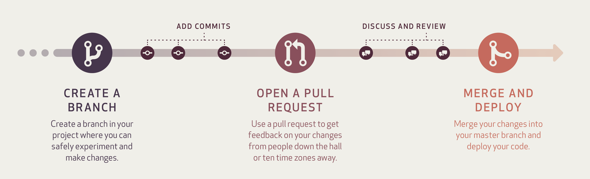

# Raidiam Trustframework Bank Swagger

This project manages the Raidiam Trustframework Bank Swagger and is responsible for generating all required models and clients.

## Contibuting

All changes need to follow this workflow.



Any published branches and pull requests will all be built with Jenkins and all commits must include the Jira ticket ID relating to the change, for example: `RPB-123 adding new resource`

The following repository rules are enforced:

- **Pushing to master is disallowed**
- **Pull requests must be up to date with master**
- **Pull requests require one approver**
- **Pull requests require successful build**

## Versioning

The specification follows a semantic versioning strategy, as such:

Given a version number MAJOR.MINOR.PATCH, increment the:

- MAJOR version when you make incompatible API changes,
- MINOR version when you add functionality in a backwards compatible manner, and
- PATCH version when you make backwards compatible bug fixes.

Additional labels for pre-release and build metadata are available as extensions to the MAJOR.MINOR.PATCH format.

This is held in the swagger specification: 
```
openapi: 3.0.0
info:
  title: "Raidiam Connect Trust Framework Bank"
  version: "1.1"
  description: Raidiam Trust Services Bank API
```

During our Continuous Integration builds we will add the `build number` to the version if its built on the master branch only, for example: `0.0.1.10` changes to the MAJOR, MINOR, PATCH should be made on the during the pull request.

## Client Generation

The following clients will be automatically built and published to our Maven repository:

- Java
